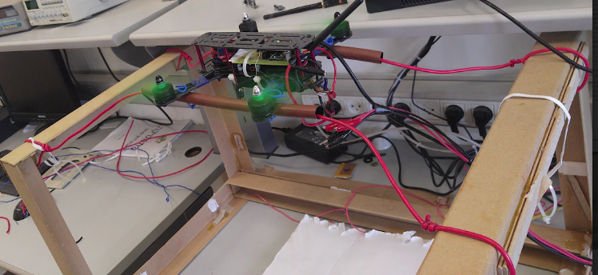
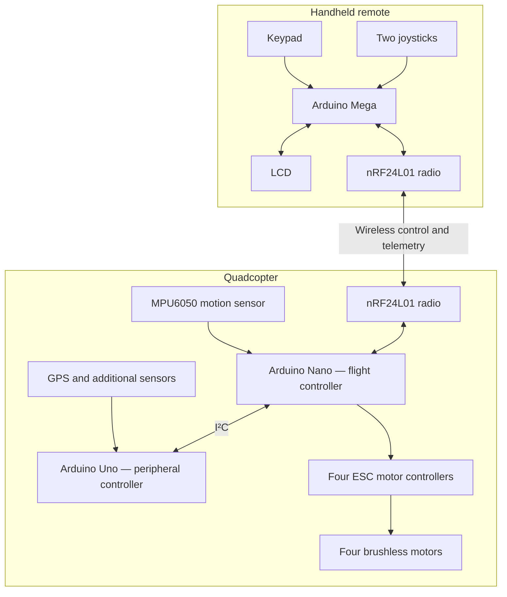
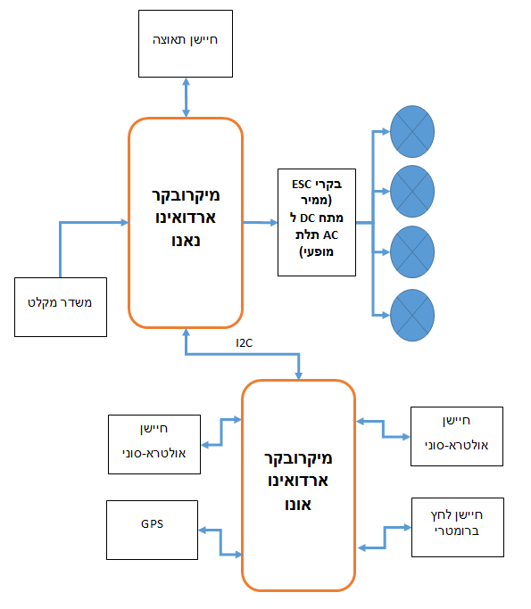
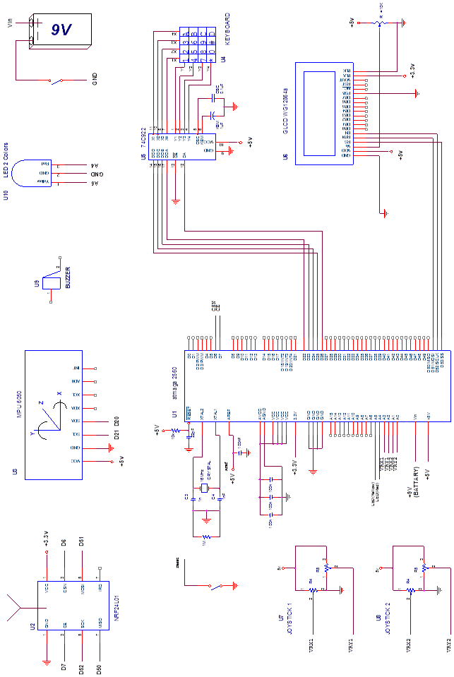
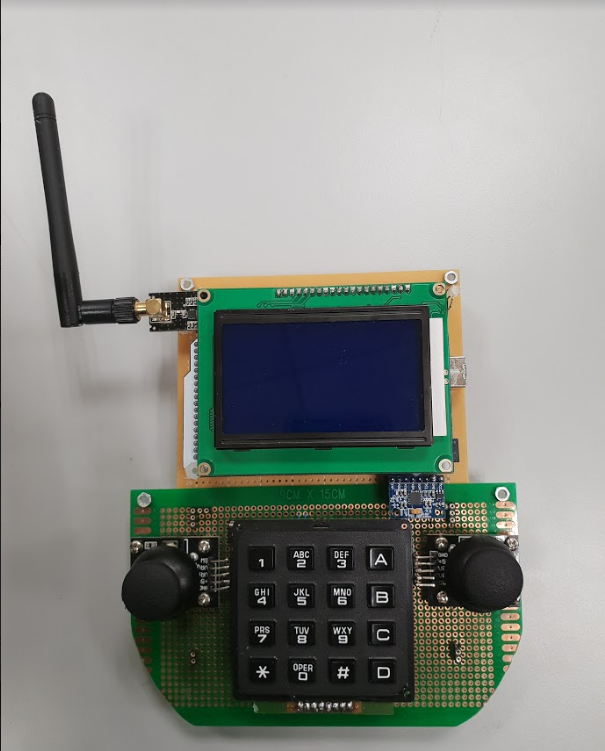
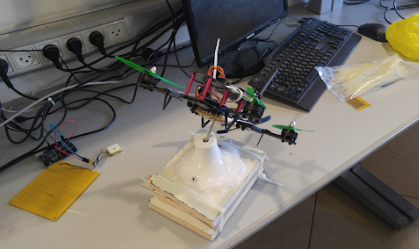
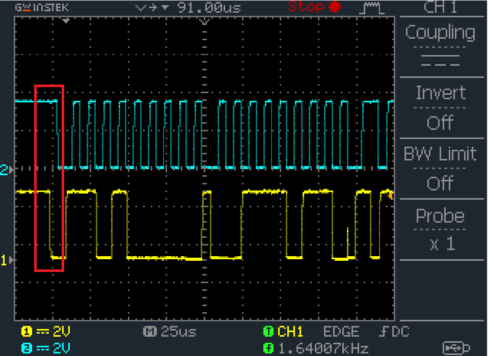

# Arduino Quadcopter with Custom PID Flight Stabilization

## Project Overview

This project was developed in **2018 as part of the final project for a Practical Engineering Diploma in Electronics and Computers** 

The goal was to design and build a quadcopter with a **custom-developed PID (Proportional–Integral–Derivative) flight stabilization system** and a dedicated wireless remote controller. The project involved integrating multiple Arduino microcontrollers, onboard sensors, wireless communication, and four brushless motors driven by ESCs.

A central part of the work was **developing and implementing our own PID flight-control algorithm**, rather than relying on a pre-built flight controller.

The work brought together mechanical assembly, electronic design, embedded programming and hands-on testing. We built the aircraft and its handheld controller, divided the onboard tasks between two Arduino boards, and developed and tuned the PID controller using physical test setups. 


*Our quadcopter on a stabilization test setup during development.*

## System architecture

The design separates the handheld controller from the aircraft. The aircraft itself uses **two cooperating microcontrollers**: an Arduino Nano for flight stabilization, motor control and radio communications, and an Arduino Uno for additional sensor/peripheral functions. An Arduino Mega handles the handheld controller.




*System block diagram showing the onboard controllers and their connections.*

## Custom PID stabilization and motor drive

A quadcopter changes attitude by changing the relative thrust produced by its four rotors. Our Nano sketch reads the MPU6050, estimates aircraft orientation, compares it with the requested angles, computes **separate PID corrections for two axes**, and mixes those corrections with the throttle command to derive four motor outputs.

```text
MPU6050 → angle estimate → desired vs. measured angle → PID X / PID Y
                                                 ↓
                                    throttle + PID motor mixing
                                                 ↓
                               four ESCs → four brushless motors
```

The [Nano implementation](src/Drone_Nano_Master/Drone_Nano_Master.ino) contains `calculateError()`, `calculatePID()` and `setMotorSpeed()`. The PID calculation uses proportional, accumulated integral and derivative terms, with output limiting. The motor-mixing routine computes a separate command for each of the four motors. **The motors are not powered directly from Arduino pins:** the Nano sends control signals to **four ESCs**, one per brushless motor; the ESCs drive the motors using the aircraft power system.


*Electrical connections between the controllers, ESCs, and motors.*

We tuned the PID controller through several rounds of testing as we assembled the aircraft and added its onboard components. The tuning steps and tested gain values are described in [Experiments and testing](#experiments-and-testing).

## Onboard Arduino controllers

### [Arduino Nano — flight-control and motor subsystem](src/Drone_Nano_Master/Drone_Nano_Master.ino)

The Nano receives radio commands, handles the MPU6050-based attitude-control loop, calculates PID corrections, and generates four ESC control outputs. It also communicates with the Uno over I²C.

### [Arduino Uno — additional sensors and peripherals](src/Drone_Uno_Slave/Drone_Uno_Slave.ino)

We used the Uno to handle additional sensors and peripherals, including GPS and ultrasonic sensing. This division kept the flight-stabilization and motor-control logic on the Nano while the Uno handled the additional sensor tasks.

### Why two boards? I²C between Nano and Uno

We configured the **Nano as the I²C master and the Uno as the I²C slave**. A wired connection lets the two onboard controllers exchange data without an extra radio module, helping us avoid unnecessary weight on the aircraft. The [Nano code](src/Drone_Nano_Master/Drone_Nano_Master.ino) and [Uno code](src/Drone_Uno_Slave/Drone_Uno_Slave.ino) show both sides of this connection.

## Custom wireless remote

### [Arduino Mega — wireless remote controller](src/Remote_Controller/Remote_Controller.ino)

The handheld controller uses an **Arduino Mega**, **two joysticks** for flight commands, a **keypad** for user input, an **LCD** for displaying entered/received data, and an **nRF24L01** radio module for communicating with the quadcopter. We also designed the keypad and display interface for entering GPS coordinates and selecting flight modes.


*Our handheld controller with joysticks, keypad, and display.*

The controller reads the user inputs, packages commands and sends them wirelessly to the aircraft; the radio link also supports information sent back to the remote for display. The nRF24L01 uses SPI to interface with its Arduino host.

## Hardware and communications

| Subsystem | Components | Role / connection |
|---|---|---|
| Flight stabilization | MPU6050 accelerometer + gyroscope | Motion feedback used by the flight controller |
| Propulsion | 4 brushless motors + 4 ESCs | Nano sends individual motor-control signals to ESCs; ESCs drive motors |
| Wireless link | nRF24L01 modules | Radio link between aircraft and handheld remote; SPI interface to Arduino |
| Inter-controller link | Arduino Nano + Arduino Uno | Wired I²C: Nano master, Uno slave |
| Position and environment | GPS, ultrasonic sensors, barometric pressure sensor | Additional onboard sensing and environmental measurements |
| Handheld interface | 2 joysticks, keypad, LCD | Command entry and data display through Arduino Mega |

We powered the propulsion system through the aircraft battery and ESCs, while the Arduino boards provided the control signals. The electrical diagrams show how the main components were connected.

## Experiments and testing

We tested the hardware and control software throughout development, using physical fixtures and measurements to refine the system:

1. **PID test fixtures:** we built and revised physical rigs to constrain the aircraft while allowing it to tilt. Earlier fixtures restricted movement; a later setup enabled more useful stabilization tests.
2. **PID tuning with changing mass:** initial tuning was performed with the motors, MPU6050 and Nano installed. Adding the GPS and other equipment changed the aircraft's behavior, prompting a new tuning process with the intended hardware installed.
3. **Recorded gain trials:** we tested an early configuration with `P=7.15`, `I=3.4`, `D=2.45`, a later tuning outcome of `P=3`, `I=0.1`, `D=0.2`, and another configuration using `P=3.55`, `I=0.003`, `D=2.05`. The Nano code in this repository uses `P=3.55`, `I=0.003`, `D=2.05` values as its initial PID gains; the other values reflect separate tuning trials.
4. **I²C / SPI observations:** we captured communication waveforms with test equipment and examined timing and signaling.
5. **Ultrasonic sensor check:** we placed a sensor approximately 40 cm from a wall; we used the measured echo pulse to calculate about **40.1 cm**.
6. **Keypad-controller test:** we examined the 74C922 keypad controller's timing circuitry with an oscilloscope.


*One of the test fixtures we used while tuning the PID controller.*


*Oscilloscope measurement taken during our hardware tests.*

## Project gallery

Photos and diagrams from the build and testing process, including the aircraft, our remote controller, and the PID test setup.

<table>
  <tr>
    <td align="center" width="50%">
      <br>
      <strong>Quadcopter during development</strong><br>
      <sub>The aircraft mounted on the stabilization test setup.</sub>
    </td>
    <td align="center" width="50%">
      <br>
      <strong>Custom wireless controller</strong><br>
      <sub>Handheld controller with joysticks, keypad and display.</sub>
    </td>
  </tr>
  <tr>
    <td align="center">
      <br>
      <strong>Stabilization test fixture</strong><br>
      <sub>Physical setup used during the PID development process.</sub>
    </td>
    <td align="center">
      <br>
      <strong>Electrical schematic</strong><br>
      <sub>Wiring diagram for the aircraft and motor subsystem.</sub>
    </td>
  </tr>
</table>

Additional photographs, circuit diagrams, flowcharts, and oscilloscope captures are available in the [project images folder](assets/original-report-images/).
